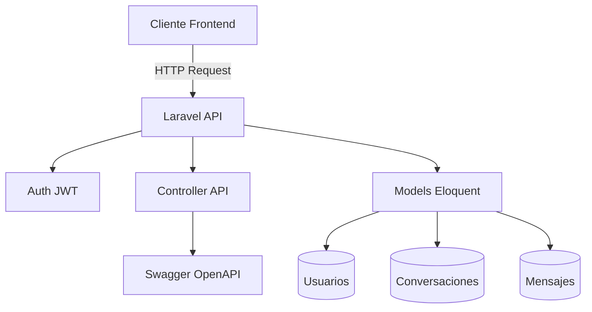
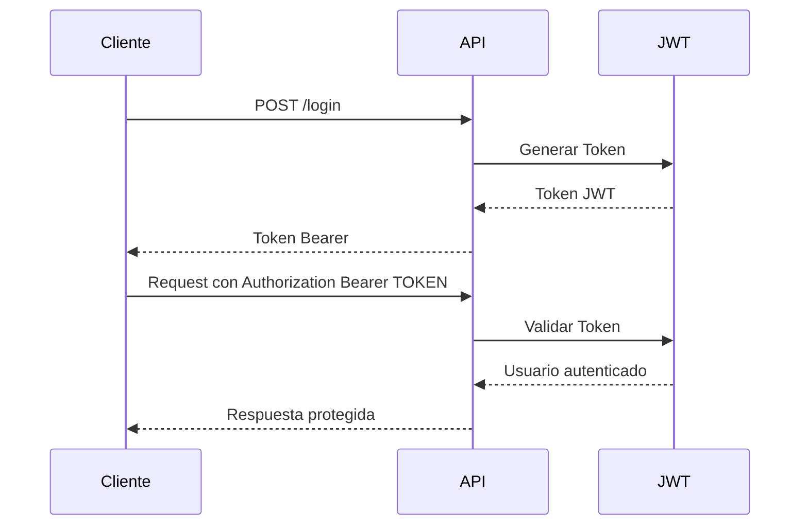
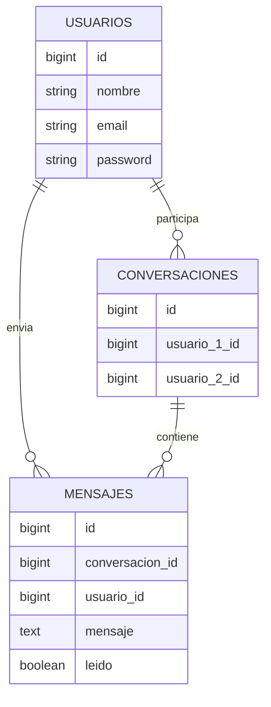

# API Mini Sistema de Mensajería

API REST desarrollada en Laravel para la gestión de autenticación JWT, conversaciones privadas y envío de mensajes entre usuarios.

---

# Tecnologías utilizadas

- Laravel
- JWT Authentication
- MySQL
- Swagger / OpenAPI
- PHP 8+
- Eloquent ORM

---

# Características principales

✅ Registro de usuarios  
✅ Login con JWT  
✅ Validación de sesión  
✅ Logout seguro  
✅ Creación de conversaciones  
✅ Envío de mensajes  
✅ Obtención de conversaciones del usuario  
✅ Obtención de mensajes por conversación  
✅ Documentación Swagger/OpenAPI  

---

# Arquitectura general



# Autenticación JWT
La API utiliza JWT para proteger las rutas privadas.
## Flujo de Autentificación



# Estructura de rutas

```PHP
Route::controller(controller_api::class)->group(function () {

    // Públicas
    Route::get('saludo', 'saludo');
    Route::post('login', 'login');
    Route::post('registroUsuario', 'register');

    // Protegidas
    Route::middleware('auth:api')->group(function () {

        Route::post('logout', 'logout');
        Route::get('validarSesion', 'validarSesion');

        Route::get('obtenerMisConversaciones', 'obtenerMisConversaciones');
        Route::post('crearConversacion', 'crearConversacion');

        Route::post('enviarMensaje', 'enviarMensaje');

        Route::get(
            'obtenerMensajesConversacion/{id}/mensajes',
            'obtenerMensajesConversacion'
        );
    });
});
```

# Endpoints públicos

## GET /api/saludo
Endpoint de prueba.

Respuesta
```json
{
  "message": "saludo"
}
```

## POST /api/login

Autenticación de usuario.

Body
```JSON
{
  "email": "usuario@test.com",
  "password": "123456"
}
```
Respuesta exitosa
```json
{
  "status": "100",
  "token": "JWT_TOKEN",
  "type": "Bearer",
  "user": {
    "id": 1,
    "nombre": "Juan Pérez",
    "email": "usuario@test.com"
  }
}
```

## POST /api/registroUsuario
Registro de nuevos usuarios.

Body
```json
{
  "nombre": "Juan Pérez",
  "email": "usuario@test.com",
  "password": "123456"
}
```
Respuesta
```json
{
  "status": "100",
  "message": "Usuario creado correctamente",
  "token": "JWT_TOKEN",
  "user": {
    "id": 1,
    "nombre": "Juan Pérez",
    "email": "usuario@test.com"
  }
}
```
# Endpoints protegidos
Todas las rutas protegidas requieren:
```http
Authorization: Bearer TU_TOKEN
```
## POST /api/logout
Cerrar sesión del usuario.

Respuesta
```json
{
  "status": "100",
  "message": "Sesión cerrada correctamente"
}
```

## GET /api/validarSesion
Validar token JWT.

Respuesta
```json
{
  "status": "100",
  "authenticated": true,
  "user": {
    "id": 1,
    "nombre": "Juan Pérez",
    "email": "usuario@test.com"
  }
}
```

## GET /api/obtenerMisConversaciones
Obtiene todas las conversaciones del usuario autenticado.

Respuesta
```json
{
  "status": "100",
  "conversaciones": []
}
```

## POST /api/crearConversacion
Crea una conversación con otro usuario.

Body
```json
{
  "usuario_receptor_id": 2
}
```
Respuesta
```json
{
  "status": "100",
  "message": "Conversación creada correctamente",
  "conversacion": {}
}
```

## GET /api/obtenerMensajesConversacion/{id}/mensajes
Obtiene todos los mensajes de una conversación.

Parámetros
| Parámetro | Tipo    | Descripción           |
| --------- | ------- | --------------------- |
| id        | integer | ID de la conversación |

Respuesta
```json
{
  "status": "100",
  "conversacion": {},
  "mensajes": []
}
```

## POST /api/enviarMensaje
Enviar mensaje a una conversación existente.

Body
```json
{
  "conversacion_id": 1,
  "mensaje": "Hola, ¿cómo estás?"
}
```
Respuesta
```json
{
  "status": "100",
  "message": "Mensaje enviado correctamente",
  "mensajeData": {}
}
```

# Modelo Relacional


# Instalación del proyecto
1️⃣ Clonar repositorio
```bash
git clone URL_REPOSITORIO
```
2️⃣ Entrar al proyecto
```bash
cd proyecto
```
3️⃣ Instalar dependencias
```bash
composer install
```
4️⃣ Configurar variables de entorno
```bash
cp .env.example .env
```
Configurar:
```env
DB_DATABASE=
DB_USERNAME=
DB_PASSWORD=
```
5️⃣ Generar key Laravel
```bash
php artisan key:generate
```
6️⃣ Generar JWT Secret
```bash
php artisan jwt:secret
```
7️⃣ Ejecutar migraciones
```bash
php artisan migrate
```
8️⃣ Levantar servidor
```bash
php artisan serve
```

# Swagger/OpenAPI
La API utiliza atributos OpenAPI para generar documentación automática.

Generar documentación
```bash
php artisan l5-swagger:generate
```
Acceso Swagger UI

```bash
http://localhost:8000/api/documentation
```
## Seguridad implementada
* Contraseñas cifradas con bcrypt
* JWT Bearer Token
* Middleware auth:api
* Validaciones Laravel
* Protección de acceso a conversaciones
* Validación de pertenencia a conversaciones

## Posibles mejoras futuras
* WebSockets en tiempo real
* Indicador de mensajes leídos
* Notificaciones push
* Eliminación de mensajes
* Subida de archivos
* Chats grupales
* Refresh tokens
* Rate limiting

# Autor

Desarrollado con Laravel y JWT Authentication.
```
Lucio Francisco Chávez García
```
